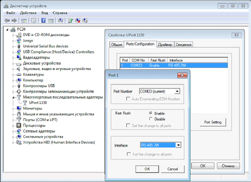
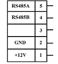
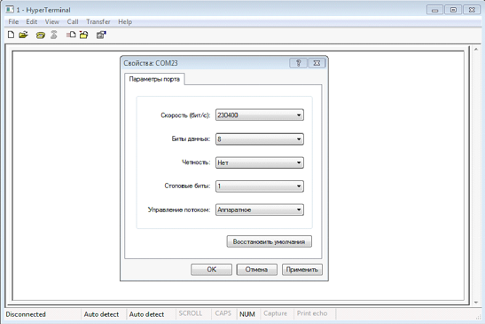
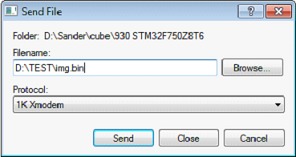

Программирование производится по интерфейсу JTAG (программатор ST-Link V2 через разъем XP1.1).
После запуска панели должен загореться белый экран.

Коммуникация с панелью осуществляется через UART по протоколу **1К Xmodem** (включить RS-485 в диспетчере устройств). Указан COM-порт, к которому подключился UART-USB преобразователь (подключен к панели через разъем XP2).

Диспетчер задач:

  

Разъем XP2:

Для передачи данных можно использовать программу **HyperTerminal**. UART настроен на скорость **230400** бит/с. 

При включении питания панель отсылает раз в секунду символ "C" в ожидании отправки изображения. При отправке файла требуется нажать Transfer – Send File, выбрать файл img.bin и указать протокол 1К Xmodem.

